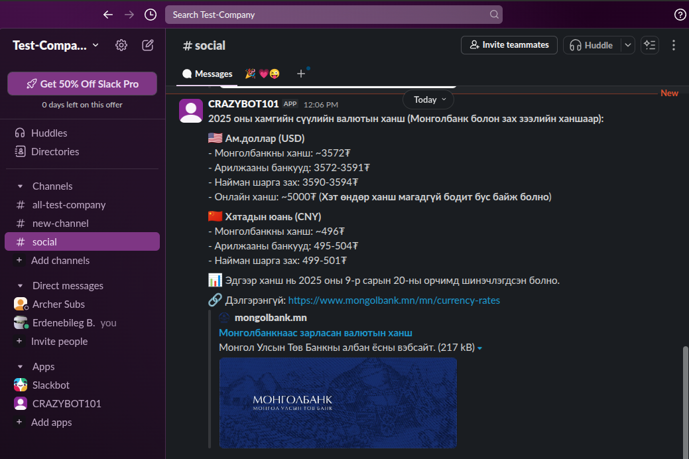

# Informant MCP Client

__Eugene__ carries out summarization and surface analysis of web searches and consistently informs you of highlights you're most interested in, which is derived from your question alone. Currently, it reports to a social media account (i.e. Slack), but can easily be extended via the addition of new MCP servers to `configs` dictionary from `program.py`.

__Eugene__ is considered a MCP client accomplished user's queries and requests through the iterations of ReAct (Reason and Act) paradigm, connected to multiple MCP servers. In other words, it is able to self-coordinate its own actions given the set of available tools aggregated from all the plugged-in servers.

I tried having minimal presumptions as to how __Eugene__ is used, meaning it's not necessarily a concrete tool for search and summarization alone. It can be modified with RAG or local database MCP servers such that it is utilized for responding to more in-depth questions.

## Set up project

### Step 1: Install requirements

```sh
pip install -r requirements.txt
```

### Step 2: Set up environment variables
```env
BASE_URL        # OpenAI-Compliant Interface URL
API_KEY         # API KEY for the client 

SLACK_BOT_TOKEN # Token similar to `xoxb-9...` after creating the bot 
SLACK_TEAM_ID   # Team/Company ID, visible from the web Slack url
SLACK_CHANNEL_IDS   # Channel ids delimited by comma

OPENAI_API_KEY  # API Key in case of using OpenAI models
EXA_API_KEY     # Exa search API key
```

### Step 3: Set off the program

Start the ReAct loop running `program.py` and the available tools from the connected MCP servers will be visible:

```sh
python program.py
```

```sh
Available tools from all servers: ['slack_list_channels', 'slack_post_message', 'slack_reply_to_thread', 'slack_add_reaction', 'slack_get_channel_history', 'slack_get_thread_replies', 'slack_get_users', 'slack_get_user_profile', 'web_search_exa', 'company_research_exa', 'crawling_exa', 'linkedin_search_exa', 'deep_researcher_start', 'deep_researcher_check']
(ctrl+c/quit)>>> Монголд доллар юаны ханш хамгийн сүүлийн байдлаар ямар байгаа хураангуйг Slack дээр social channel руу явуулаарай.

>>>BOT: {
  "rationale": "The user is requesting recent exchange rates between the Mongolian Tögrög (MNT) and both the US Dollar and Chinese Yuan, and then wants a summary of that information posted to the Slack social channel. First, I need to gather the latest rates from the web.",
  "decision": "tool",
  "message_to_user": "Доллар болон юанийн хамгийн сүүлийн ханшийн мэдээллийг интернетээс хайж байна...",
  "tool": {
    "name": "web_search_exa",
    "args": {
      "query": "Монголбанк доллар юань ханш өнөөдөр",
      "num_results": 3
    }
  }
}

>>>BOT: {
  "rationale": "I now have the latest exchange rate information for USD and CNY in Mongolia and need to send this summary to the 'social' channel in Slack as requested.",
  "decision": "tool",
  "message_to_user": "Вальютын ханшийн мэдээллийг Slack-ийн 'social' суваг руу илгээхээр бэлдэж байна...",
  "tool": {
    "name": "slack_post_message",
    "args": {
      "channel": "social",
      "text": "2025 оны 9-р сарын 22-ны байдлаар валютын ханш:\n\n💵 **Америк доллар (USD)**: 1 USD ≈ 5000₮ (шинэчилсэн ханшаар IFC Markets)\n🏦 Монголбанк зарласан ханш: 3572 - 3600₮\n💬 Арилжааны төвүүд: 3590 - 3594₮\n\n💴 **Хятадын юань (CNY)**: 1 CNY ≈ 500₮ (coinmill.com)\n🏦 Монголбанк зарласан ханш: 493.6 - 507.2₮\n💬 Арилжааны төвүүд: 499 - 501₮\n\nЭх сурвалжууд: Монголбанк, IFC Markets, ikon.mn, eguur.mn"
    }
  }
}

>>>BOT: {
  "rationale": "The latest exchange rates for USD and CNY were found from multiple sources and a summary was successfully posted to the Slack channel named 'social'.",
  "decision": "answer",
  "message_to_user": "Ам.доллар, юанийн хамгийн сүүлийн ханшийн мэдээлэл Slack-ийн 'social' суваг руу амжилттай илгээгдлээ. Та очиж шалгана уу."
}

(ctrl+c/quit)>>>quit
Quitting the interaction cycle...
```

### Resulting message on Slack..



## Project Structure

```sh
├── config
│   └── system.txt          # System prompt for ReAct cycling
├── data
├── License
├── mcp_client              # Everything related to MCP server connection
│   ├── __init__.py
│   ├── multiple_clients.py # MCP client in connection to multiple servers
│   └── stdio_client.py     # MCP client in event of a single server
├── program.py              # Main entrance to run the program
├── README.md
├── requirements.txt        # Requirements
├── src
│   └── models.py           # Functions to get in contact with models
└── utils                   # Helper modules tba later
```

## License
This project is licensed under the MIT License - see [License](https://github.com/ebinomial/eugene/blob/main/License) for more details.